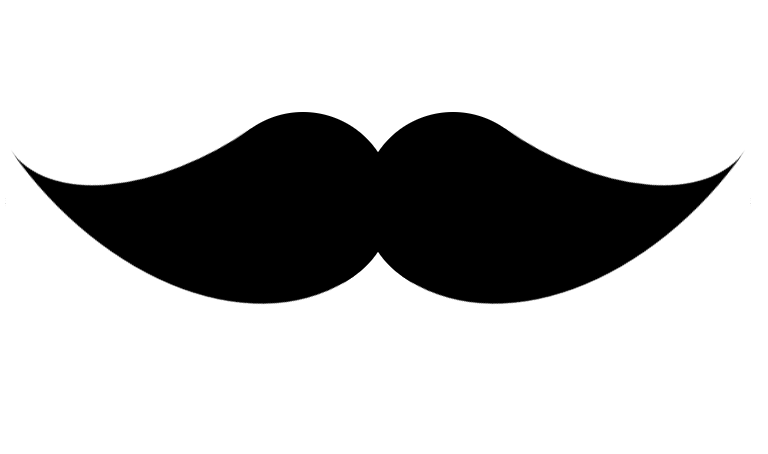

# Drawing With CSS

Being a backend developer for much of my career up to this point much of the frontend always seemed like magic. After learning React and moving to becoming more of a Fullstack developer some of these concepts still evaded me.

This is when I decided to look more at manipulating imagery using CSS, HTML, and JS. Now, these concepts are often overlooked as they do not add anything functional, but can offer some cool creative ways of using code. In this repository you will find my ongoing learning for building some cool things in CSS.

The cool thing about using CSS rather than simply an SVG is it givs us full control of the element programatically. Rather than having multiple SVGs of different colors we can have a single element of which we can change the color on the fly. This is the power of CSS.

# Previews

    
Mustache

    
Character

